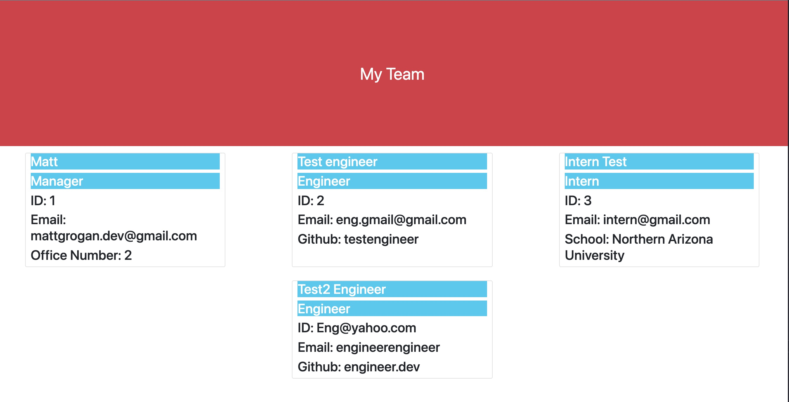

  Team Profile Generator 

## Description

In this project I created a Node.js command-line application that takes in information about employees on a software engineering team, then generates an HTML webpage that displays summaries for each person.

## Table of Contents

- [Installation](#installation)
- [Usage](#usage)
- [Repository-Link](#repository-link)
- [Media](#media)
- [Test Instructions](#test-instructions)
- [Questions](#questions)
- [License](#license)

## Installation

Once you have cloned the repo run "node index.js" to begin the series of prompts. The first prompt will be for the manager role, and after that you can create as many Engineers and Interns as you would like.

## Usage

Create as many people as you would like on your new team by following the prompts given. When you are finished creating your last team member simply select the option "Finish building team" and your new website will be created. Look in the "dist" folder for your new webpage which will be saved as "index.html".

## Repository-Link

[Github Repo Link](https://github.com/mattgrogandev/team-profile-generator)

## Media

[Video Demonstration](https://watch.screencastify.com/v/cRqXp2aXgGK9brPgl7oH)

## Test-Instructions

To test that these items work first run "npm i" in the command line to import Jest. Then, run "npm run test" in the command line and you will see that all tests go through successfully if downloaded properly.

## Questions

If you have any questions regarding this project please contact either on GitHub or by Email below.

GitHub: [mattgrogandev](https://github.com/mattgrogandev)

Email: mattgrogan.dev@gmail.com

## License

Licensed under the MIT license.

[Link to opensource.org license info](https://opensource.org/licenses/MIT)
